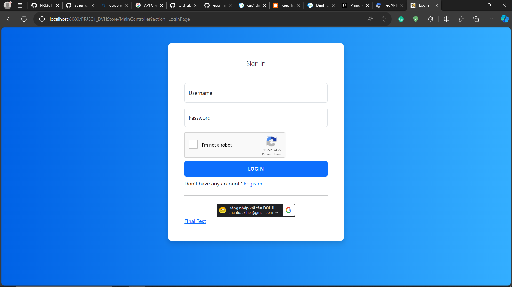
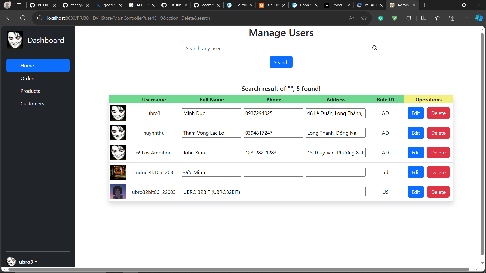
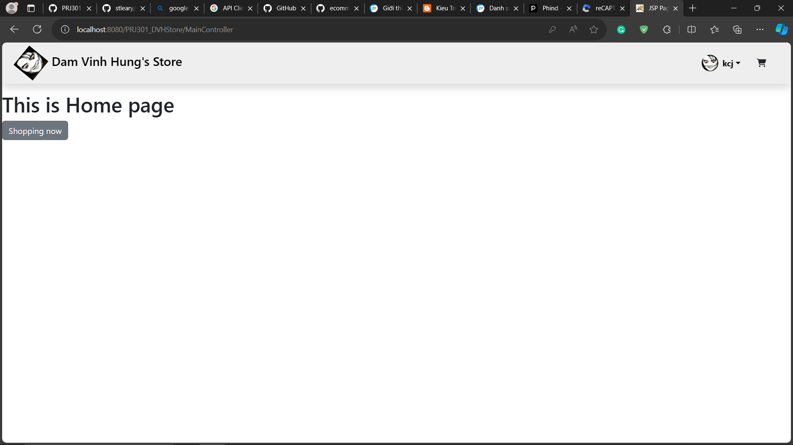
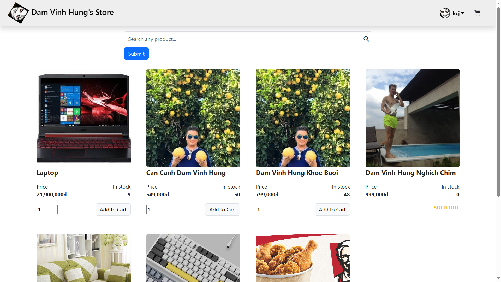
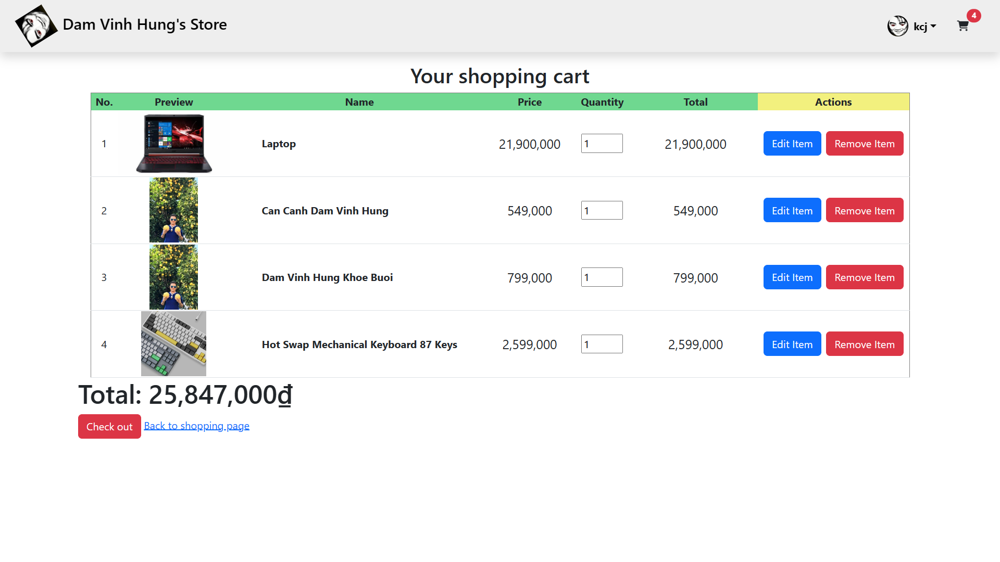
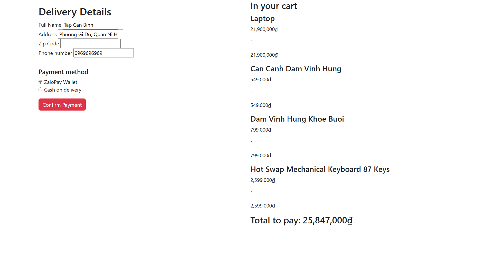
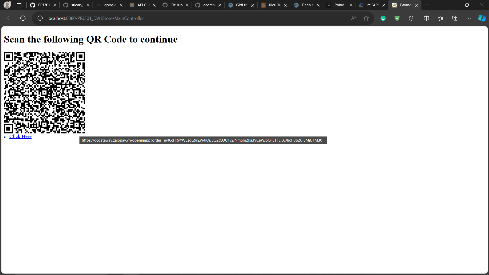
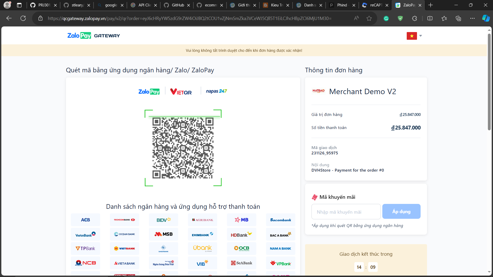
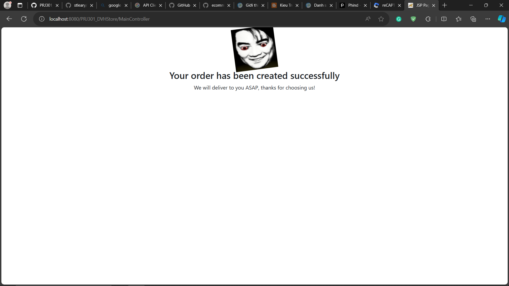

# Dam Vinh Hung's Store LITE (DVHStore Lite)
A simple shopping website, inspired by my Django e-commerce project (DVHStore)
This is a final project on Java Web Development (PRJ301) and is graded 10/10 by HoaDNT *(kind of)*

# Features
- Login and sign up using username/password credentials or Google Account (OAuth2)
- Admin Dashboard (User Management)
- Shopping Cart
- Payment using ZaloPay or COD (Cash on delivery)

# Technology
- Java 8 EE
- Apache Tomcat 8.5
- Django Rest Framework (for ZaloPay Merchant API endpoint)

# Dependencies
- ZaloPay Merchant API [Read the docs here to build your API endpoint](https://docs.zalopay.vn/v2/general/overview.html)
- Log4j 1.2.17 [Download here](https://archive.apache.org/dist/logging/log4j/1.2.17/log4j-1.2.17.zip)
- Google API Client (For Google login) [Download here](https://developers.google.com/api-client-library/java/)
- Json in Java (For API call) [Download here](https://github.com/stleary/JSON-java)

# Preview

 
